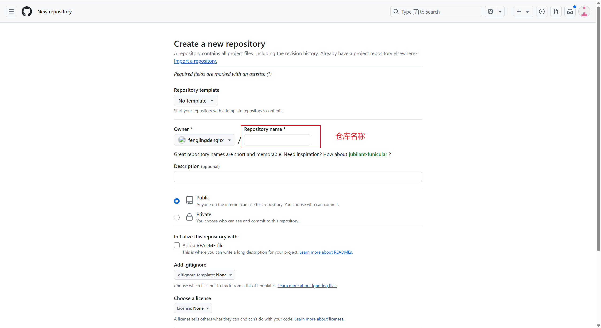
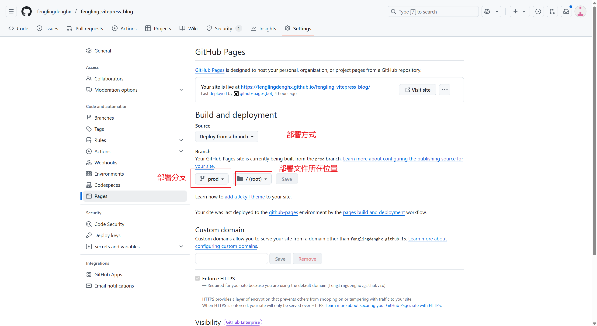

# 将 vitepress 项目部署到 github 并实现自动更新
## 1. 创建仓库

## 2. 初始化git
:::code-group
```sh [git]
// 项目目录下打开中断运行以下命令
$ git init
```
:::
> [git下载地址](https://git-scm.com/)
## 3. 添加.gitignore 文件
:::code-group
```sh [git]
// 忽略一下不需要提交到 github 的文件以及目录
node_modules
dist
cache
.temp
.DS_Store
```
:::
## 4. git设置忽略大小写
```sh
# 全局设置
git config --global core.ignorecase false
# 项目目录单独设置
git config core.ignorecase false
```
## 5. 上传代码
```sh
# 将主分支设置未 main
git branch -M main
# 将文件提交到暂存区
git add .
# 将暂存区文件提交到版本库
git commit -m "init project"
# 关联远程仓库 git@github.com:userName/repositoryName.git 这里是你自己的仓库地址
git remote add origin git@github.com:userName/repositoryName.git
# 将版本库推送到远端仓库
git push -u origin main
```
## 6. 将 vitepress 打包结果部署到 github pages

::: info 如上图所示
- Build and deployment 下选择 `Deploy from a branch`
- 分支选择 prod
- 文件所在位置选择 根路径(/)
:::
## 7. 实现github workflows 工作流
1. 在项目根目录创建 `.github`目录
2. 在`.github`下创建`workflows`目录
3. 在`workflows`下创建`deploy.yml`

<<< ../.github/workflows/deploy.yml{yml}