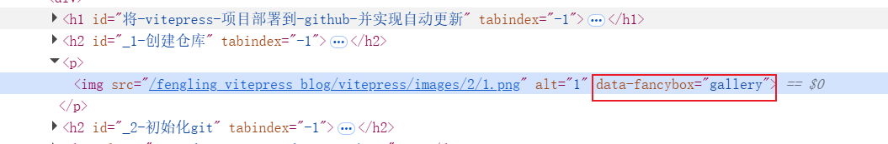

# VitePress中实现图片预览功能
## 1. 安装 markdown-it 插件
::: code-group
```sh [npm]
npm install markdown-it-custom-attrs
```
```sh [pnpm]
pnpm add markdown-it-custom-attrs
```
:::
## 2. 在 VitePress 配置文件中引入 markdown-it 插件
```ts
import { defineConfig } from 'vitepress'
import mdItCustomAttrs  from 'markdown-it-custom-attrs'
export default defineConfig({
   markdown: {
    config(md) {
      // 为markdown文档中所有的图片添加data-fancybox属性
      md.use(mdItCustomAttrs, 'image', {
        'data-fancybox': 'gallery',
      })
    },
  }
})
```
> [!TIP] 提示
> 引入之后查看页面图片标签是否被添加了 `data-fancybox="gallery"`的自定义属性

**如下图**

## 3. 在 VitePress 中引入预览图片插件 Fancybox
```ts
import { defineConfig } from 'vitepress'
export default defineConfig({
  head: [
    // cdn 链接请参考官网 https://fancyapps.com/fancybox/getting-started/#cdn
    // 添加fancybox的css
    ["link", { rel: "stylesheet", href: "https://cdn.jsdelivr.net/npm/@fancyapps/ui@5.0/dist/fancybox/fancybox.css" },],
    // 添加fancybox的js
    [
      "script",
      { src: "https://cdn.jsdelivr.net/npm/@fancyapps/ui@5.0/dist/fancybox/fancybox.umd.js" }
    ],
    // 为fancybox绑定事件
    // 这里需要注意的是，fancybox的js文件需要在绑定事件之前加载完成
    [
      "script",
      { id: 'FancyboxBind' },
      `;(() => {
          // 使用Fancybox后需要绑定一下才会生效
          window.addEventListener('load', function () {
            if (window.Fancybox) {
              Fancybox.bind("[data-fancybox]", {
                // Your custom options
              });
            }
          })
        })()`
    ],
  ]
})
```
